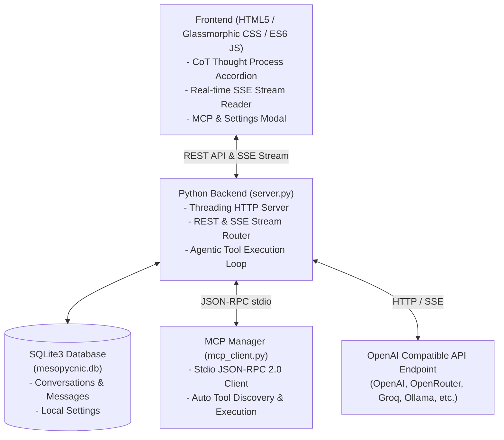

# ⚡ Mesopycnic

**Mesopycnic** is a lightweight, ultra-fast, low-footprint AI chat frontend designed to run seamlessly on constrained systems (4GB RAM laptops, Raspberry Pi) and mobile devices (using Python via Termux on Android). 

It features native support for **Model Context Protocol (MCP)** servers, real-time **Chain-of-Thought (CoT)** reasoning visualization, persistent **SQLite3** chat history, and full compatibility with any **OpenAI-compatible API**.

---

## ✨ Features

- **⚡ Zero External Backend Dependencies**: Built using Python 3 standard libraries (`http.server`, `sqlite3`, `subprocess`, `urllib`). Starts in milliseconds and consumes <20MB RAM.
- **🛠️ Native Model Context Protocol (MCP) Support**: Connect stdio MCP tool servers (Python, Node.js, `npx`, `uvx`, or custom binaries) configured via `mcp_servers.json`. Automatically translates tool schemas and handles multi-turn tool execution.
- **🧠 Chain-of-Thought (CoT) Reasoning View**: Dedicated collapsible reasoning container with live duration spinners for reasoning models (DeepSeek R1, OpenAI o1/o3-mini, Ollama thinking models, etc.).
- **🤖 Any OpenAI-Compatible API**: Works with OpenAI, OpenRouter, Groq, Ollama, LM Studio, vLLM, DeepSeek, or any custom endpoint base URL.
- **💾 Local SQLite3 Storage**: Conversations, messages, tool execution logs, and API settings are stored locally in `mesopycnic.db`.
- **🎨 Glassmorphic Dark UI**: High-aesthetic responsive web interface with markdown rendering, syntax code highlighting, and copy buttons. Mobile & Termux ready.

---

## 🏗️ System Architecture



---

## 🚀 Quick Start

### 1. Prerequisites
- **Python 3.8+** (No `pip install` required!)

### 2. Run Mesopycnic
```bash
git clone https://github.com/AccSwtch50/vibecoded-mesopycnic.git
cd vibecoded-mesopycnic
python3 server.py
```
Open **http://localhost:8000** in your browser.

---

## 🛠️ Configuring MCP Servers

MCP tool servers are configured in `mcp_servers.json` in the root project directory (or edited directly from the UI by clicking **MCP Servers** in the sidebar):

```json
{
  "mcpServers": {
    "math_and_time": {
      "command": "python3",
      "args": ["sample_mcp_server.py"],
      "enabled": true
    },
    "parallel-search": {
      "command": "npx",
      "args": [
        "-y",
        "mcp-remote",
        "https://search.parallel.ai/mcp"
      ],
      "enabled": true
    }
  }
}
```

### Supported MCP Transports
- **Stdio Processes**: Python scripts, Node.js scripts, `npx`, `uvx`, or compiled binaries.
- Relative script paths in `args` are resolved automatically relative to the project directory.

---

## 📱 Running on Mobile / Termux (Android)

1. Install **Termux** on Android.
2. Install Python & git:
   ```bash
   pkg update && pkg install python git
   ```
3. Clone & run:
   ```bash
   git clone https://github.com/AccSwtch50/vibecoded-mesopycnic.git
   cd vibecoded-mesopycnic
   python3 server.py
   ```
4. Open `http://localhost:8000` in your Android web browser.

---

## 🧪 Running Tests

Mesopycnic comes with an automated unit and integration test suite:

```bash
python3 -m unittest discover -p "test_*.py"
```

---

## 📁 Project Structure

```text
.
├── server.py              # Main HTTP Server & REST/SSE API router
├── db.py                  # SQLite3 database CRUD manager
├── mcp_client.py          # Stdio MCP JSON-RPC 2.0 client & runner
├── mcp_servers.json       # MCP server configuration file
├── openai_service.py      # OpenAI SSE streaming proxy & CoT parser
├── sample_mcp_server.py   # Out-of-the-box Python MCP tool server
├── static/                # Frontend web interface assets
│   ├── index.html         # Single-page app HTML layout
│   ├── style.css          # Glassmorphic dark styling & animations
│   └── app.js             # ES6 client logic & SSE parser
├── test_*.py              # Comprehensive test suite
├── memory/                # Gitignored internal developer memory
└── README.md              # Project documentation
```

---

## 📄 License

Distributed under the [GPL-3.0 License](LICENSE).